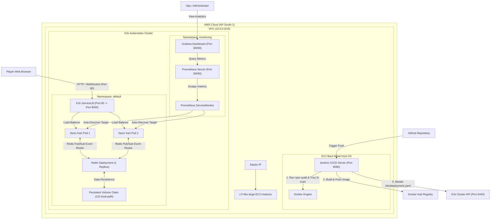
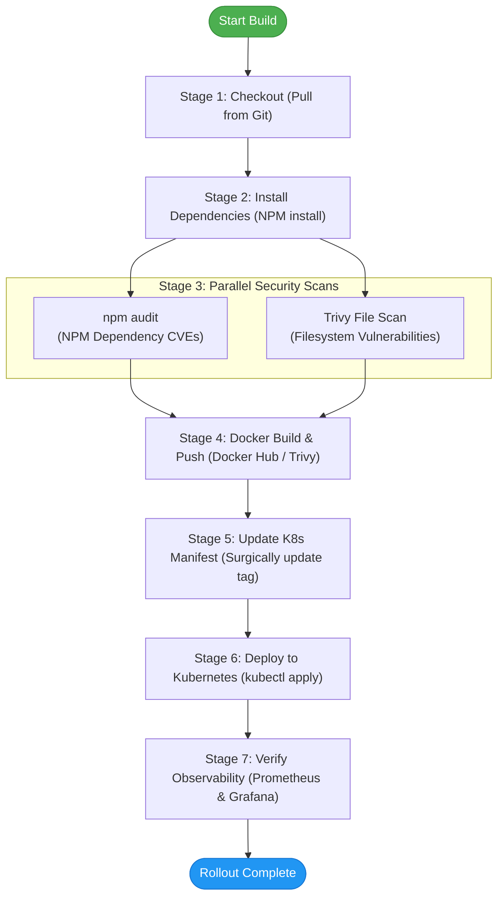

# 🏎️ Neon Kart Battle: Cloud-Native Multiplayer Game

[](https://nodejs.org/)
[](https://socket.io/)
[](https://redis.io/)
[](https://www.docker.com/)
[](https://k3s.io/)
[](https://www.terraform.io/)
[](https://www.jenkins.io/)
[](https://prometheus.io/)
[](https://opensource.org/licenses/MIT)

<p align="center">
  <video src="https://raw.githubusercontent.com/Akash123-cyber/Neon-Kart-Cloud-Architecture/main/img/demo/homepage%20.mp4" width="100%" autoplay loop muted playsinline style="border-radius: 8px; box-shadow: 0 4px 20px rgba(0,0,0,0.4);"></video>
</p>

Neon Kart Battle is a real-time multiplayer kart racing game with support for both PvP rooms and solo bot matches. It is built on a cost-optimized, self-managed cloud architecture. Instead of using expensive managed services, the entire stack runs on a lightweight **K3s (Kubernetes)** cluster provisioned with **Terraform**, deployed automatically via **Jenkins**, and monitored using **Prometheus & Grafana**.

---

## 📖 Table of Contents
1. [Key Architectural Features](#-key-architectural-features)
2. [Cloud-Native System Architecture](#%EF%B8%8F-cloud-native-system-architecture)
3. [Repository Directory Structure](#-repository-directory-structure)
4. [Core Game Mechanics & Netcode](#-core-game-mechanics--netcode)
5. [Dual-Tier Session Persistence](#-dual-tier-session-persistence)
6. [Continuous Integration & DevSecOps](#-continuous-integration--devsecops)
7. [Observability & Monitoring](#-observability--monitoring)
8. [Local Development Setup](#-local-development-setup)
9. [Infrastructure Provisioning (Terraform)](#-infrastructure-provisioning-terraform)
10. [Production Jenkins CI/CD Setup](#-production-jenkins-cicd-setup)

---

## 🚀 Key Features

- **Low-Cost Kubernetes Setup (Saves $73+/month):** Avoids AWS EKS control plane fees. The entire environment—K3s cluster, Jenkins build engine, and monitoring stack—runs on a single `c7i-flex.large` EC2 instance provisioned by Terraform.
- **Horizontal Scaling via Redis:** Uses Socket.io's Redis adapter to sync events across pods, allowing game sessions, authentication, and player connections to scale horizontally without losing track of state.
- **Smooth Gameplay (30Hz Server, 60Hz+ Client):** To save bandwidth, the server runs physics ticks and broadcasts game state at 30 FPS. The browser client applies client-side linear interpolation (lerping) on coordinates and angles, rendering smooth movement even on high-refresh-rate monitors.
- **Built-in Security Scanning:** The Jenkins pipeline runs security scans using `npm audit` and checks container/file security using `Trivy`, automatically blocking builds if critical security issues are found.
- **App Telemetry:** The server uses `prom-client` to expose metrics like active players, event-loop lag, and endpoint response times on a `/metrics` route for Prometheus to scrape.

---

## 🗺️ Cloud-Native System Architecture

Here is how the infrastructure, namespaces, data flows, and monitoring paths are set up:



---

## 📁 Repository Directory Structure

```bash
├── Dockerfile                      # Multi-stage production container build (Node 18 Alpine)
├── Jenkinsfile                     # 7-stage automated DevSecOps and deployment pipeline
├── package.json                    # Node dependencies (Express, Socket.IO, prom-client, Redis, Bcryptjs)
├── server.js                       # Game server: matchmaking, Redis event broker, auth routes, game loop
├── game.js                         # Game client: Canvas rendering, client LERP, Sound Synth, Bot AI
├── index.html                      # Glassmorphism UI lobby interfaces and HTML5 canvas container
├── style.css                       # Modern CSS styling (Glassmorphism layout, animations)
├── neon-kart-grafana-dashboard.json # Pre-configured JSON dashboard for Grafana imports
├── k8s/                            # Kubernetes Orchestration manifests
│   ├── deployment.yaml             # Horizontally-scaled game server pods config with liveness/readiness probes
│   ├── service.yaml                # LoadBalancer Service mapping traffic (port 80 -> 8000)
│   ├── redis.yaml                  # Persistent Redis database Deployment, Service, and local-path PVC
│   └── prometheus-servicemonitor.yaml # ServiceMonitor telling Prometheus Operator to scrape metrics
├── terraform/                      # Infrastructure as Code manifests
│   └── main.tf                     # Provisions AWS VPC, Security Group, EIP, EC2 instance, and user_data scripts
└── ProjectRelatedMarkdownFiles/    # Extended architectural research documentation
    ├── technical_architecture.md   # Core engine specs, networking models, and authentication logic
    ├── Implementation.md           # Step-by-step checklist of development phases
    ├── k3s_architecture_guide.md   # In-depth mechanics of K3s, ServiceLB, and Traefik configurations
    ├── JENKINS_SETUP_GUIDE.md      # Detailed Jenkins initialization guide
    └── terraform_architecture_guide.md # Concepts of declarative IaC and AWS bootstrapping script details
```

---

## 🎮 Core Game Mechanics & Netcode

### Matchmaking & Rooms
To prevent broadcasting unnecessary events to all players, the game groups active players using **Socket.IO Rooms**.
1. **Room Creation:** Creating a room generates a 6-character lobby code (e.g., `XJ8K3Q`) and configures custom settings like the map theme and room size (2-10 players).
2. **Lobby Updates:** The lobby shows real-time player lists and restricts the game from starting until the room is full.
3. **Authoritative Pod Routing (Master Room Ownership):** When a user creates a room, the specific Node.js pod that handled the request registers itself in Redis as the authoritative host ("Master Owner") for that lobby. Other players who join query Redis to find this owner pod, routing their keystrokes and collision events directly to it to avoid state desync.

<p align="center">
  <video src="https://raw.githubusercontent.com/Akash123-cyber/Neon-Kart-Cloud-Architecture/main/img/demo/PVP.mp4" width="100%" autoplay loop muted playsinline style="border-radius: 8px; box-shadow: 0 4px 20px rgba(0,0,0,0.4);"></video>
</p>

### Interpolation (LERP)
To optimize network bandwidth costs, the server ticks physics and broadcasts player coordinates at **30 FPS**. To ensure smooth rendering on modern high-refresh-rate displays (60Hz to 240Hz+), the client browser calculates the delta time (`dt`) and uses linear interpolation to render intermediate frames:
```javascript
// Position Lerp
op.x += (op.targetX - op.x) * lerpFactor;
op.y += (op.targetY - op.y) * lerpFactor;

// Shortest-arc Angle Lerp (prevents erratic 360-degree spins)
let angleDiff = op.targetAngle - op.angle;
while (angleDiff >  Math.PI) angleDiff -= 2 * Math.PI;
while (angleDiff < -Math.PI) angleDiff += 2 * Math.PI;
op.angle += angleDiff * lerpFactor;
```

---

## 💾 Dual-Tier Session Persistence

To avoid database bottlenecks under load, player stats are split into two storage tiers:

### 1. Registered Users (Redis Persistence)
User credentials are hashed using `bcrypt` and stored in Redis hashes (`user:${username}`). Since the user database is centralized in Redis, the Node.js app servers are stateless, avoiding database lock issues and scaling easily:
- **Stored Data:** `password_hash`, `wins`, `matches_played`, and `high_score`.

<p align="center">
  <video src="https://raw.githubusercontent.com/Akash123-cyber/Neon-Kart-Cloud-Architecture/main/img/demo/auth.mp4" width="80%" autoplay loop muted playsinline style="border-radius: 8px; box-shadow: 0 4px 20px rgba(0,0,0,0.4);"></video>
</p>

### 2. Guest Sessions (Hybrid In-Memory & Local Storage)
To keep the Redis database from bloating with temporary guest data:
- **Active Sessions (Server RAM):** Temporary gameplay variables (coordinates, health, live scores) live in the server's memory and are deleted as soon as the user disconnects.
- **Local Stats (Browser Local Storage):** Long-term metrics like total wins and high scores are saved locally using the browser's `localStorage`, letting guest accounts persist their stats between plays without a backend account.

---

## 🛡️ CI/CD & Security Scan Pipeline

The [Jenkinsfile](./Jenkinsfile) automates the full build, security validation, and deployment cycle:



1. **Checkout:** Clones the repository.
2. **Install Dependencies:** Runs `npm install` on the build machine.
3. **Parallel Security Scans:**
   - **npm audit:** Scans dependencies for known NPM security issues.
   - **Trivy File Scan:** Scans the repository filesystem for vulnerabilities or hardcoded secrets.
4. **Docker Build & Push:** Builds the Docker container, runs a Trivy image vulnerability scan, and pushes the image tagged with the build number and `:latest` to Docker Hub.
5. **Update K8s Manifest:** Updates the container image tag in `k8s/deployment.yaml` using a `sed` script.
6. **Deploy to Kubernetes:** Loads K3s cluster credentials from a secure credential file and deploys the manifests using `kubectl`.
7. **Verify Observability:** Pings the monitoring endpoints to ensure Prometheus and Grafana are healthy.

---

## 📊 Observability & Metrics

We track system performance and in-game statistics using a Prometheus and Grafana setup:

### Metric Collection (`prom-client`)
- **Runtime Stats:** Standard Node.js process data (CPU usage, event loop lag, and heap memory usage).
- **Active Players:** A custom metric (`neon_kart_active_players`) that registers how many players are currently connected to each individual application pod.
- **HTTP Latency:** A histogram mapping response latencies and status codes across different endpoints.

### Grafana Dashboard
Importing the [neon-kart-grafana-dashboard.json](./neon-kart-grafana-dashboard.json) file sets up a live monitoring dashboard showing:
- **🟢 Connected Players:** A live gauge showing total concurrent players.
- **📈 Connections over Time:** A time-series chart showing traffic split between active pods.
- **⚡ Server Load:** A gauge indicating how close the server is to its maximum concurrent player capacity (20).
- **🧠 Node.js Memory:** RSS and heap memory usage tracked per pod.
- **⏱️ HTTP Response Time:** p50, p90, and p95 latencies for server endpoints.
- **💻 Kubernetes Pod Resources:** CPU and memory usage tracked at the pod container level.

---

## 💻 Local Development Setup

### Prerequisites
- Node.js (v18.x or higher)
- Redis server running locally (or fallback to Local-Memory simulation Mode automatically if connection times out)

### Installation
1. Clone the repository:
   ```bash
   git clone <your-repo-url>
   cd Neon-Kart-Cloud-Architecture
   ```
2. Install standard production and development dependencies:
   ```bash
   npm install
   ```
3. Boot the Express and Socket.IO server:
   ```bash
   npm start
   ```
4. Access the client interface at `http://localhost:8000`.

---

## 🛠️ Infrastructure Provisioning (Terraform)

### Prerequisites
- Install Terraform (v1.5+)
- AWS CLI configured with administrator privileges (`aws configure`)
- SSH key pair named `neon-kart-key` generated in region `ap-south-1`

### Deployment Steps
1. Navigate to the infrastructure folder:
   ```bash
   cd terraform
   ```
2. Initialize provider plugins (installs AWS providers):
   ```bash
   terraform init
   ```
3. Perform a syntax and config validation check:
   ```bash
   terraform validate
   ```
4. Execute a dry-run to preview resources to be created:
   ```bash
   terraform plan
   ```
5. Apply modifications (provisions VPC, EC2, Subnets, Helm, K3s, and Monitoring Stack):
   ```bash
   terraform apply -auto-approve
   ```
6. Take note of the printed Outputs (e.g. `elastic_ip`). Keep the EC2 `.pem` key secure for SSH connection.
7. Teardown resources when done to avoid AWS billing costs:
   ```bash
   terraform destroy -auto-approve
   ```

---

## ☸️ Production Jenkins CI/CD Setup

### 1. Unlock Jenkins
Following a successful `terraform apply`, access the Jenkins UI at `http://<EC2_PUBLIC_IP>:8080`. Retrieve the initial administrator key:
```bash
ssh -i neon-kart-key.pem ubuntu@<EC2_PUBLIC_IP>
sudo cat /var/lib/jenkins/secrets/initialAdminPassword
```
Paste this into the login page, then select "Install Suggested Plugins".

### 2. Install Pipeline Plugins
Navigate to **Manage Jenkins → Plugins → Available Plugins** and install:
- `Docker Pipeline`
- `Credentials Binding`
- `Pipeline: GitHub`
- `Timestamper`

### 3. Add Environment Credentials
Navigate to **Manage Jenkins → Credentials → System → Global credentials → Add Credentials**:
- **Credential 1 (Docker Hub Registry):**
  - **Kind:** Username with password
  - **ID:** `dockerhub-credentials`
  - **Username:** your Docker Hub profile name (e.g. `malikakash`)
  - **Password:** your Docker Hub password or personal access token
- **Credential 2 (K3s Access Config):**
  - **Kind:** Secret file
  - **ID:** `kubeconfig-secret`
  - **File:** Upload the generated cluster config from your EC2 instance (`/home/ubuntu/.kube/config` or `/etc/rancher/k3s/k3s.yaml`)

### 4. Create Pipeline Job
1. Click **New Item**, enter `neon-kart-pipeline`, and select **Pipeline**.
2. Under **Pipeline Definition**, select **Pipeline script from SCM**.
3. Choose **Git** as the SCM, input your GitHub repo HTTPS URL, and target the branches parameter to `*/main`.
4. Define the script path as `Jenkinsfile`.
5. Click **Save** and trigger a test build using **Build Now**.
